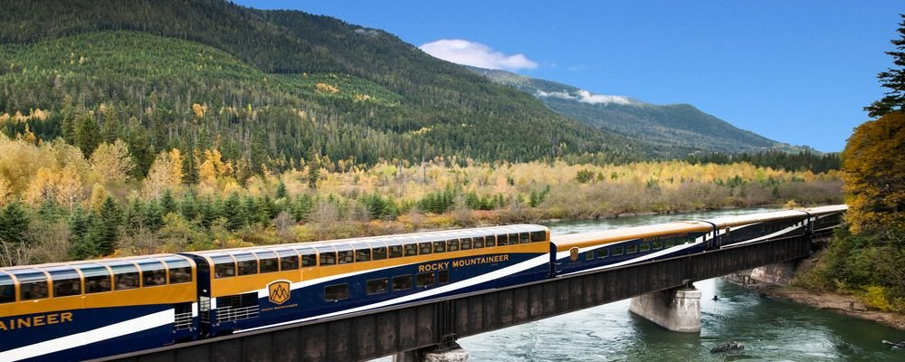
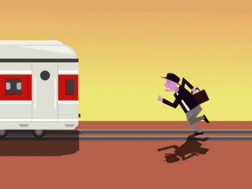

# IRCTC-ONLINE-BOOKING-CANCELLATION-WEB-APPLICATION-MODEL
All the reservation process is done through online from any place in the world. This web application saves money, manpower, time.

<h3 align="left">About the Project</h3>

In the existing system Reservation is done manually by a user at railway reservation
counters. User has to wait for a long time in the queue to get the reservation. This wasted
the time of user and for this lot of man power is required. and lot of paper work is also
required.

To avoid all the above pitfalls the system proposed is **“Railway Online
Booking/Cancellation Web Application Model”**. In this , all the reservation process is
done through online from any place in the world. This web application saves money,
manpower, time.
The basic functions being performed by my web application model are maintaining
records ,booking and cancellation. These functions are described as follows:-
* It reserves or books and cancels seats of passenger (using booking master and
booking history).
* It contains information and data about the stations ( in station master).
* It contains information and data about the trains (train master).
* It contains information about the passenger (in user master).
* It contains the details of reservations fare or the train fare (in train fare).
* It makes entries for reservation, cancelled tickets.
* It will update for details of trains.
* The passenger could search for trains from a particular source to destination
* The record of train status includes dates for which tickets can be booked, total
number of seats available, number of seats already booked.

<h3 align="left">Functionality</h3>

The scope of this project encompasses: -

**Search:** This function allows the user to search for train that are available between the
two travel places, namely the "source" and "destination" as desired by the traveller. The
system initially prompts for the departure and arrival city, the date of departure,
preferred time slot and the number of passengers. It then displays a list of train available
with the designated cities .

**Selection:** This function allows a particular train to be selected from the displayed list.
All the details of the train are shown :-
1. Train Number
2. Date, time and place of departure
3. Date, time and place of arrival
4. Train Duration

**Update:** This function will allow the admin to update the details.

**Delete:** This function will allow the admin to delete the details.
**Review:** If the seats are available, then the software prompts for the booking of train.
The train information is shown.

**Traveller Information:** It asks for the details of all the passengers supposed to travel
including name, address ,e-mail id etc.

**Cancellation:** The system also allows the passenger to cancel an existing reservation
of via booking history.This function registers the information regarding a passenger
who has requested for a cancellation of his/her ticket. 

<h3 align="left">Tech Stack</h3>

* **HTML:** The web page layout has been designed in html.
* **CSS:** CSS has been used the web design.
* **Java Script:** All the validation task and the animations has been developed by
java script.
* **JSP:** JSP has been used for writing the front end logic.
* **MySQL:** MySQL database has been used as database for the project
* **Java**: The backend portion is built by using java.
* **Apache tomcat:** This web application runs over the tomcat server.

